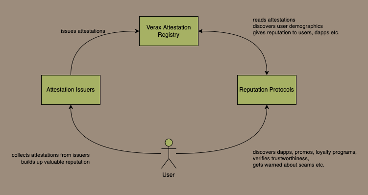

# Ecosystem

## A Layered Model of the Attestation Ecosystem

Verax is a set of smart contracts that allows dapps and protocols to register public datapoints known as attestations, that can be easily read and composed by other dapps, either directly via their own on-chain smart contracts, or via an off-chain indexer.

The real value emerges from the rich ecosystem of dapps that leverage Verax to share attestations.  This ecosystem involves several classes of actors that we can think of as being organised in a stack of layers, as visualized in the following diagram:

<figure><figcaption>
Layered Model of Verax Ecosystem
</figcaption></figure>

* **Infrastructure Layer:** these are the core smart contracts that allow dapps to issue and read attestations on-chain.
* **Data Layer:** these are actors that index the on-chain attestations from the registry into an off-chain database so that complex queries can be run against the data.  Eventually we hope that people can query the on-chain data using a number of different independent sources, such as Dune, or The Graph etc.  However, the community is also planning to create an open source indexer that anyone can run.
* **Compute Layer:** these are actors that run compute over the data and derive useful insights and analytics from the data.  They can surface any sort of information of value, including:
  * insights about users of specific dapps, such as demographics, interests, region etc.
  * information about the reputation of smart contracts or tokens which helps to prevent scams
  * analysis about smart contract addresses to filter out sophisticated bot activity
  * fair and transparent credit scores for under-collateralized loans
  * fair and transparent recommendation engines that deliver relevant, high quality content to users without intermediaries that may be biased or have mis-aligned incentives
* **Adoption Layer:** these are the points at which users interact with the ecosystem, and if everything is working as it should, this is the only layer the users should be aware of.  This is where users can take advantage of the value that dapps offer them, that comes from having a shared, public datalake of attestations from which those dapps can derive valuable insights and robust permissionless reputation.  Users can discover a range of high quality dapps / services / content and be sure that it is all verifiable on-chain, and dapps can easily find the users that they can bring value to.

***

## An Attestation Market Structure Model

The above layered model is a useful way to think about the ecosystem that is built on a shared public attestation registry.  Another useful mental model for thinking about an attestation registry is as the basis for a market in reputation.

Users can accrue reputation based on collecting attestations.  A user may have several reputations contexts, none of which need to be linked to their real world identity, but can prove things about them, such as their contributions to DAOs, their interests in art, music, or gaming, their professional skills, their on-chain activity, their credit history etc.   These pseudonymous reputation contexts have value because they allow dapps to find loyal users, and they allow users to find dapps that are relevant and trustyworthy and from which they can some utility value.

Reputation protocols can help users to discover useful dapps, and for dapps to find product-market-fit and establish a loyal user base, but they rely on being able to derive insights from public data aka attestations.

<figure><figcaption></figcaption></figure>
