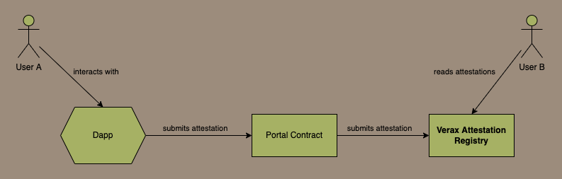
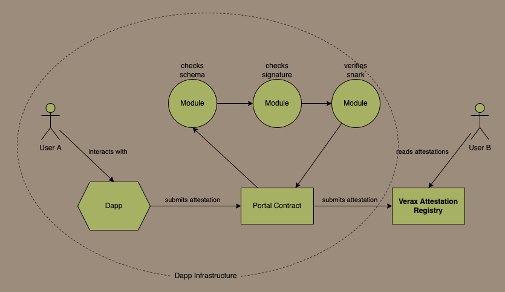

# High Level Overview

Verax is simply a set of smart contracts that form a location that many dapps can record attestations, rather than recording those attestations in their own contracts or as an NFT.

Most attestations are currently recorded as NFTs or SBTs, but recording attestations in a consolidated storage location on-chain (like an attestation regsitry) makes them much easier to discover, and makes them much easier to consume.

## How Attestations are Recorded

### Portals

Verax is designed for dapps to use as to store attestations, and is not designed for the end users to interact with directly.  Instead, dapps interact with Verax through a smart contract called a [**portal**](portals.md), which is owned and controlled by the dapp.  The Verax attestation registry will only accpet attestations from regsitered portals.

<figure><figcaption></figcaption></figure>

Users interact with the dapp, and send transactions to the dapp's portal contract, which will perform some verification checks or other actions according to the dapps own business logic, and the portal contract will then register an attestation in the registry.  This gives the dapp complete control over how their users interact with the registry and what business rules they want to establish.  Portal contracts are deployed by dapps, and are under their complete control.

### Modules

Most dapps will probably want to do a few basic things, like verify a signature, check the data structure of the attestation, perhaps charge a fee for registering the attestation. Dapps can do these things using modules, which are other smart contracts that perform simple verification logic.  A portal can chain together these modules and every new attestation goes through each module in the chain, and module performs a simple check on the attestation.  If all modules verify the new attestation successfully, the portal then submits the attestation in the registry.

<figure><figcaption></figcaption></figure>

Its worth pointing out that dapps don't have to use modules, they can customise the portal contract and put all their logic in there, but the benefit of using modules is that dapps can use the modules that other created before.  For example, if one dapp decides it needs a module to verify a merkle proof, then any other dapp that needs to verify a merkle proof can just use that module
