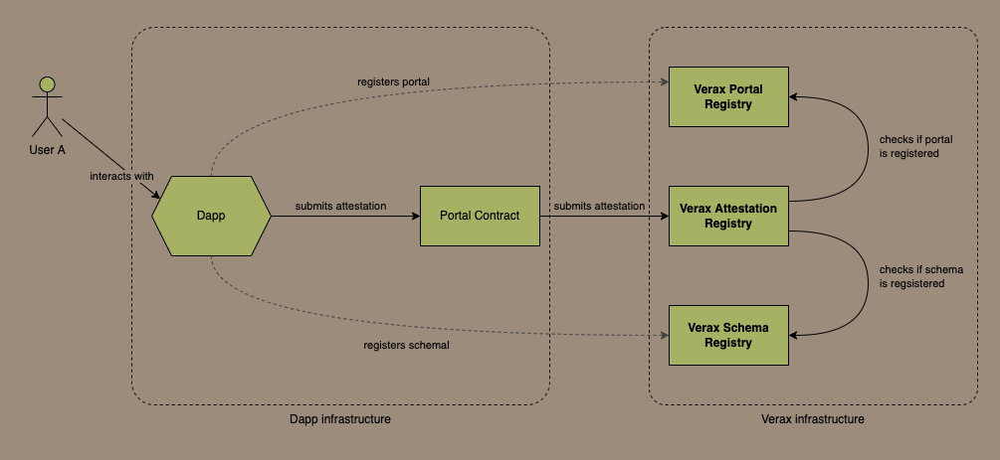

# High-Level Overview

Verax is simply a set of smart contracts that allow dApps to register attestations.
DApps can record attestations in a consolidated location on-chain, rather than recording those attestations in their own
contracts, or as an NFT.

Most attestations are recorded as NFTs or SBTs, but recording attestations in a consolidated storage location
on-chain makes them much easier to discover, and makes them much easier to consume.

## How Attestations are Recorded in the Registry

### Portals

Verax is designed for dApps to store attestations, it is not designed for the end users to interact with
directly.
DApps interact with Verax through a smart contract called a [**portal**](portals.md), owned and controlled by the dApp.
The attestation registry will only accept attestations from registered portals.

<figure><figcaption>
Users interact with dApps, dApps record attestations through their portal contract
</figcaption></figure>

Users interact with the dApp and send transactions to the dApp's portal contract, which will perform verification
checks or other actions according to the dApps own business logic.
The portal contract will then record an attestation in the registry.
This gives the dApp complete control over how their users interact with the registry and what business rules they want
to establish.
Portal contracts are deployed by dApps, and are under their complete control.

### Modules

Most dApps will probably want to do a few basic things, like verify a signature, check the data structure of an
attestation, perhaps charge a fee for issuing the attestation.
DApps can do these things using [**modules**](modules.md), which are small smart contracts that perform simple
verification logic.
A portal can chain together these modules, and every new attestation goes through each module in the chain, and each
module performs a simple check.
If all modules verify the new attestation successfully, the portal then submits the attestation in
the registry.

<figure><figcaption>
A dApp that uses a chain of modules to perform verification checks on incoming attestations
</figcaption></figure>

It is worth pointing out that dApps don't have to use modules.
They can customise the portal contract and put all their logic in there, but the benefit of using modules is that dApps
can use the modules that other dApps created before.
For example, if one dApp decides it needs a module to verify a merkle proof, then any other dApp that needs to verify a
merkle proof can just reuse that module.

### Schemas

Attestations are only useful if people can reference them and understand what they are attesting to.
To do this, there needs to be a way to describe the data structure of the attestation data.
To do this, every attestation references a [**schema**](schemas.md).
A schema is basically a description of the properties in an attestation and what their respective data types are.
DApps can use any existing schema or create their own.
They can use as many schemas as they want, but only one per attestation.

In order for an attestation to reference a schema, that schema needs to be registered in the schema registry.
Portals and modules also need to be registered.
When a new attestation is made, the attestation registry checks if the portal submitting the attestation is registered,
and checks if the schema the attestation is based on is also registered.

<figure><figcaption></figcaption></figure>

***

To get more of an overview of how the attestation registry is used and how it fits into the ecosystem, see the [*
*ecosystem page**](ecosystem.md) for information of the various actors, and the roles they play.

***

As Verax is composed of on-chain smart contracts that dApps issue attestations to, the first thing to learn about is how
these smart contracts are organized and how attestations are issued.
Fortunately, the core concepts are all relatively simple, so getting started is quick and easy.
The first concept to learn about is what attestations are.
