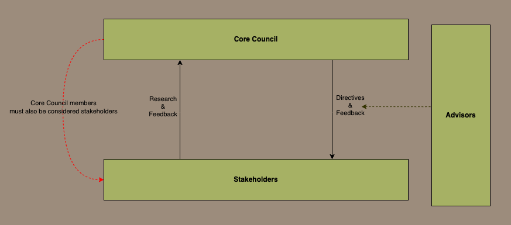
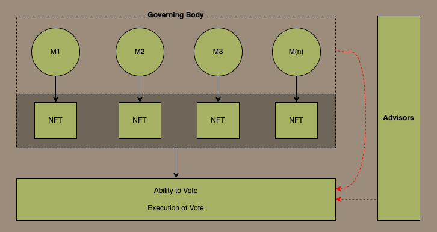
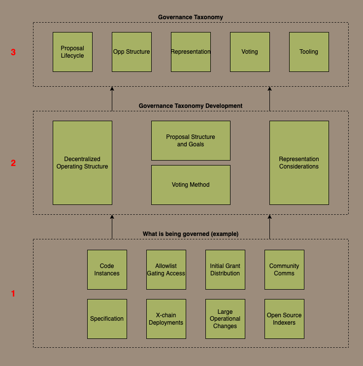

# Overview of Governance


The protocol governance aims to be transparent, inclusive and fair, while avoiding an overly bureaucratic and slow
process, allowing the protocol to quickly adapt to a rapidly evolving ecosystem. This means the governance system itself
will need to evolve over time, and we encourage improvement proposals from the community.


### Introduction

Verax aims to employ a unique governance model, Proof of Contribution, that leverages attestations to ensure equitable
governance participation among all core stakeholders and contributors. This model aims to overcome the shortcomings of
understanding multi-dimensional stakeholder interests, often financial, allowing the protocol to scale with a research
and contributory-based approach.

The protocol's governance is engineered to evolve from a small-scale model into a fully self-sustaining governance
system. By focusing on open and transparent protocol development, and then evolving the system through the use of
attestations as a measure of contribution and stakeholder interest, Verax sets the stage for a governance model that is
both scalable and equitable.&#x20;

### 1. Verax Governance

The governance structure outlined in this document is specifically designed for the bootstrapping phase of the protocol.
Governance in decentralized protocols is not static; it should evolve as the protocol matures and moves towards complete
decentralization. However, during the initial stages, the focus is on creating a governance model that maximizes
transparency and the ability to develop in an open-source environment rapidly.

The bootstrapping phase is an essential period where the foundational elements of the protocol are developed. It's a
time of rapid development and decision-making, where the governance structure must be agile enough to adapt to changing
conditions. At the same time, the process must be transparent and inclusive to build trust among stakeholders and
encourage broad participation.

The multi-tiered governance structure, featuring the Core Council, Advisory Board, and Community Contributors, is
designed to meet these dual objectives. It allows for quick, informed decision-making through mechanisms like the
Adaptive Quorum while ensuring a wide range of perspectives are considered. This balance is crucial for the protocol's
long-term success and paves the way for a more decentralized governance structure as the protocol matures.

### 2. Fractured Interests in Protocol Governance

Protocol governance systems often diverge goals among key stakeholders. For example, those with significant financial
interests tend to prioritize sustainability and brand equity since these goals align with the financial performance of a
protocol investment. On the other hand, founding teams and core contributors prioritize technological advancements and
feature implementation as their interests lie more with the protocol's overall adoption and technological progress.

Navigating the complexity of these divergent interests requires a systematic approach. Three essential elements -
Innovation (I), Oversight (O), and Adaptability (A)- can serve as the pillars of a balanced governance system (BGS) and
must be maximized by the number of active participants (P). This is simply expressed as:

$$BGS=max\left\{ \frac{I+O+A}{P} \right\}$$

above encapsulates the idea that a governance system should strive to find the optimal balance of these three elements
among the most significant number of active participants. By doing so, the governance model aims to reconcile the
fractured interests of various stakeholders, thereby fostering a more effective and equitable governance system.

It should also be mentioned that introducing a governance token can incentivize active governance participation and aid
the balancing of stakeholder interests without undermining core objectives (i.e. innovation, oversight, and control
among active participants). While this topic will not be explored extensively in this document – governance tokens can
serve as another mechanism leveraged for the protocol that may potentially be explored in the future.

#### 2.1 Bootstrapping Protocol Governance - Adaptive Quorum

In the initial stages of a protocol, the absence of a governance token allows for a concentrated focus on technological
advancement, feature implementation, and maximizing participation among core stakeholders. Developed openly, the
protocol benefits from the contributions of various projects, enhancing its feature set and implementation roadmap. A
council-like formation is recommended to govern this bootstrapping phase effectively, consisting of representatives from
three key stakeholder groups: Networks, Advisors, and Core Contributors. These groups are pivotal as the protocol's
growth and feature expansion will directly impact them.

To address the need for rapid decision-making among contributors, we introduce the "Adaptive Quorum." This governance
mechanism expedites decision-making processes while maintaining a balanced governance system. Unlike traditional
quorums, which often require a majority or supermajority to pass a decision, the Adaptive Quorum is calibrated to
maximize agility—i.e., the ability to make quick, yet informed, decisions.

The formula for the Adaptive Quorum, which accommodates both basic and significant scenarios:

$$\text{adaptive quorum}=\left( \frac{\text{number of core stakeholders}}{2} \right)(1+C \cdot 0.32)$$

C represents the "Critical Factor," ranging from 0 to 1. At C=0, the quorum defaults to half of the core stakeholders,
aligning with basic decision-making requirements. At C=1, indicating maximum importance, the quorum rises to 66% of the
core stakeholders. This quorum enables adaptability to situational urgency. The Critical Factor can be adjusted in
real-time, allowing the quorum to flex between 50% and 66% of the core stakeholders.

The Critical Factor C is not arbitrary but is based on a pre-determined set of categorizations that are agreed upon by
the core stakeholder group. These categorizations could range from "Routine" to "Critical," each corresponding to a
specific numerical value of U. For example:

* Routine: C=0
* Moderate: C=0.5
* Critical: C=1

By incorporating a pre-determined and agreed-upon Critical Factor, the Adaptive Quorum provides a governance mechanism
that is both flexible and structured. It allows for rapid decision-making while ensuring that such decisions are made
with broad stakeholder input, making it a uniquely effective tool for governance in a fast-paced environment.

#### 2.2 Governance Structure: A Simple Multi-Tiered Approach to Decision-Making

The initial governance structure of Verax is designed as a multi-layered system to ensure a balanced and inclusive
decision-making process. Each layer has specific roles, responsibilities, and mechanisms for interaction, creating a
dynamic yet structured governance model.

<figure><figcaption></figcaption></figure>

The Core Council serves as the apex decision-making body, responsible for setting the strategic direction of the
protocol, approving major upgrades, and overseeing the other governance layers. Comprised of representatives from
required stakeholder groups, namely Networks and Core Contributors, the council utilizes the Adaptive Quorum for rapid
yet balanced decisions. Meetings are bi-weekly or as needed, can be based on Critical Factor C, and the council's
composition includes a fixed number of decided seats with rotating members.

The Advisory Board acts as a specialized committee that focuses on various aspects such as technology, finance, and
community engagement. They provide expert advice to the Core Council and may have the authority to decide on specific
matters. Decision-making on the board generally employs a simple majority vote, unless the matter is escalated to the
Core Council. Meetings are held monthly or as required, and the boards are composed of subject matter experts, which may
include external advisors.

Stakeholders are any dApp or protocol that hsa integrated with registry, either by issuing attestations, or by depending
on attestations within their dApp. These stakeholders are issued NFTs and can vote on proposals. NFTs are issued to
stakeholders by the core council.

In the initial stages of the project, the core council will have veto power over proposals that have been voted for, to
guard against governance attacks or any other unforeseen issues. As the project and protocol matures, these “training
wheels” will be removed in order to further decentralize control over the protocol. This is to ensure safety of the
protocol in the very early stages of its development, and broadly aligns with the idea of progressive decentralization.

By employing this multi-tiered governance structure, the protocol ensures that decision-making is both agile and
inclusive. It accommodates a wide range of perspectives while maintaining the ability to act swiftly when needed. This
layered approach provides the flexibility to adapt to changing conditions, ensuring the protocol's long-term stability
and success.

#### 2.3 Voting Mechanism: leveraging NFTs and Attestations for Inclusive Participation

The governance structure during the bootstrapping phase is intentionally designed to focus on transparency and open
governance, rather than resilience against capture.&#x20;

This approach is aligned with the protocol's broader goals of rapid development and community engagement. The governance
model aims to attract diverse contributors and stakeholders by prioritizing transparency and openness. This, in turn,
facilitates the pooling of varied perspectives and skills, which is crucial for the protocol's growth. However, as the
protocol matures and moves towards complete decentralization, mechanisms to enhance resilience against capture may be
integrated into the governance structure.

Custom ERC-721 tokens enable a "one person, one vote" system within the Core Council. These NFTs are time-bound,
enabling voting only within specific blocks determined by the (broader governance structure). The broader Core Council
and Advisory Committee will determine and control the time-bound variable. The core council and advisory Committee can
also control the minting and burning of NFTs, but this control mechanism must be reevaluated based on the size of the
council. Using NFTs ensures that each voter represents a core identified stakeholder, adding a layer of verification and
accountability to the voting process.

<figure><figcaption>
Governing body governs the time-bound ability to vote and the addition or removal of NFTs
</figcaption></figure>

The participation of the Core Council and the broader community is documented within the attestation registry. This
registry records contributions and activities, providing a transparent and verifiable record that can be used to
establish best practices for the broader governance system. As the protocol matures and the attestation registry plays a
more significant role in decision-making, these attestations will become increasingly important.

For example, Attestations provided by contributors, the Core Council, and Advisory Teams can all play a role in the
renewal process for Core Council members. This creates a merit-based system where contributions are recognized and
rewarded, ensuring that the most active and valuable members are retained in decision-making roles.

#### 2.5 The Future of Verax Governance

Governance is not meant to be a static, but rather evolve over time as the community grows. Therefore, the governance
process will be reviewed on an ongoing basis, and feedback is welcome from the community an how the protocol is
governed.

While the core protocol and infrastructure is still under development, the core council will retain veto power, but this
will be reviewed in the future. To start with, voting will take place off-chain using snapshot, and votes will be based
on NFTs issued to any dApp that has completed an end-to-end integration to issue attestations, or has been a core
contributor of the project.

At the start of the second quarter of 2024, we plan to move to on-chain voting, at which stage the time-decay function
will kick in. This will mean that any NFT holder that doesn't participate in voting for a specific amount of time will
lose their voting rights.

On an ongoing basis we will continue to research how we can leverage attestations for reputation weighted voting. Whie
there have been a number of promising pieces of research into how this could be achieved (
e.g. [DAO Decentralization: Voting-Bloc Entropy, Bribery, and Dark DAOs](https://arxiv.org/abs/2311.03530), or
Beyond [Collusion Resistance: Leveraging Social Information for Plural Funding and Voting](https://papers.ssrn.com/sol3/papers.cfm?abstract\_id=4311507)),
it will require a significant amount of attestations from diverse sources in order to create a system that is robusst
enough to safely govern a protocol. the object is that this is what governance will evolve into over time.

As well as the voting mechanism, the actual structure of governance will likely evolve over time as well. The diargram
belows illustrates some of the various concerns that governance will need to address over time and how they could
potentially be structured.

<figure><figcaption></figcaption></figure>

\
\
