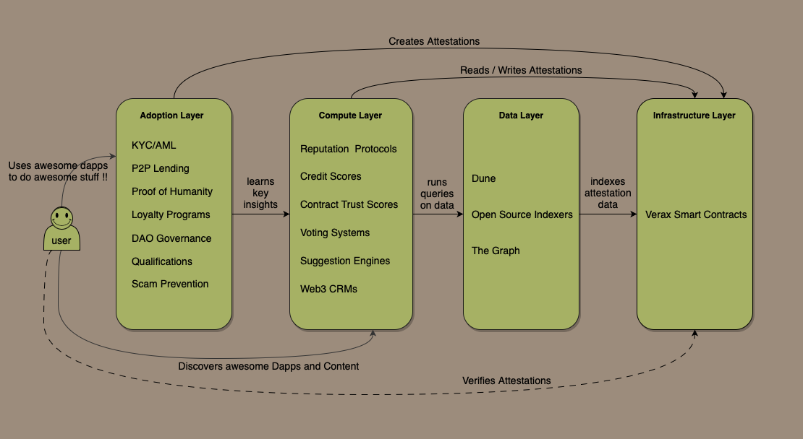

# ✨ Getting Started

Verax is a set of smart contracts that allows dapps and protocols to register public datapoints known as attestations, that can be easily read and composed by other dapps, either directly via their own on-chain smart contracts, or via an off-chain indexer.

The real value emerges from the rich ecosystem of dapps that leverage the Verax to share attestations.  This ecosystem involves several classes of actors that we can view as being organised in a stack of layers, as visualized in the following diagram:

<figure><figcaption>
Layered Model of Verax Ecosystem
</figcaption></figure>

* **Infrastructure Layer:** these are the core smart contracts that allow dapps to issue and read attestations on-chain.
* **Data Layer:** these are actors that index the on-chain attestations from the registry into an off-chain database so that complex queries can be run against the data.  Eventually we hope that people can query the on-chain data using a number of different independent sources, such as Dune, or The Graph etc.  However, the community is also planning on creating an open source indexer that anyone can run.
* **Compute Layer:** these are actors that run compute over the data and derive useful insights and analytics from the data.  They can surface any sort of information of value, including:
  * insights about users of specific dapps, such as demographics, interests, region etc.
  * information about the reputation of smart contracts or tokens which helps to prevent scams
  * analysis about smart contract address to filter out sophisticated bot activity
  * fair and transparent credit scores for under-collateralized loans
  * fair and transparent recommendation engines that deliver relevant, high quality content to users without intermediaries with biased and mis-aligned incentives.
* **Adoption Layer:** these are the points at which users interact with the ecosystem, and if eveything is working as it should, this is the only layer the users should be aware of.  This is where users can take advantage of the value that is unlocked from having a shared, public datalake of attestations that dapps can leverage to derive valuable insights and robust permissionless reputation.  Users can discover a range of high quality dapps / services / content and be sure that is that it is all verifiable on-chain, and dapps can easily find the users that they can bring value to.

***

As Verax is composed of on-chain smart contracts that dapps issue attestations to, the first thing to learn about is how these smart contract are organized and how attestations are issued. Fortunately the core concepts are all relatively simple, so getting started is quick and easy.
